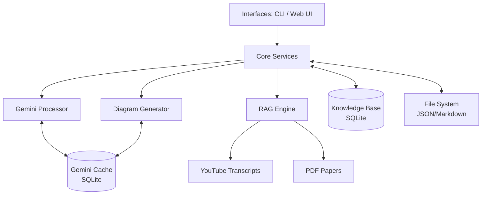

# 🏗️ Architecture Overview

The AI Learning Engine follows a modular, service-oriented architecture designed for local execution.



## 📦 High-Level Components

### 1. Core Logic (`core/`)
The brain of the application.
- **`gemini_processor.py`**: Handles interaction with Google Gemini API. Includes the `SimpleGeminiCache` to prevent redundant API calls.
    - **Responsibility**: Syllabus parsing, structure extraction.
    - **Models**: Uses `google-genai` SDK (v2).
- **`rag.py`**: Retrieval Augmented Generation engine.
    - **Responsibility**: YouTube search/scrape (`DrissionPage`), Vector Storage (`FAISS`), Document retrieval.
    - **Stack**: LangChain, Gemini 2.5 Flash.
- **`ingest.py`**: Data persistence layer.
    - **Responsibility**: SQLite Knowledge Base (`data/memory.db`), JSON/Markdown I/O.
- **`diagram_generator.py`**: Gemini-powered visual mapping engine.
    - **Responsibility**: Generates complex conceptual diagrams and relationship maps using Gemini 2.5 Flash. Uses caching to minimize quota usage.
    - **Stack**: LangChain (for prompt management and parsing).
- **`models.py`**: Data Definitions.
    - **Stack**: Pydantic v2.
    - **Key Models**: `Subject`, `Module`, `Topic`, `Question`.

### 2. Caching Layer (New!)
- **Mechanism**: SQLite-based persistent cache (`data/cache.db`).
- **Purpose**: Intercepts identical LLM prompts across `GeminiProcessor` and `MermaidDiagramGenerator`.
- **Benefit**: Drastically reduces API quota consumption and drops generation latency for repeated requests from ~15s down to <0.1s.

### 3. Interfaces
- **CLI (`cli.py`)**: Primary entry point.
    - **Stack**: `Typer`, `Rich`.
    - **Features**: Interactive commands, workflow guidance, visual feedback.
- **Web UI (`streamlit/app.py`)**: Graphical explorer.
    - **Stack**: Streamlit.
    - **Features**: Mind map visualization, quiz interface.

### 4. Visualization (`visual/`)
- **`mindmap_v2.py`**: Mermaid.js generation.
    - **Output**: `.mmd` text files.
- **`animate.py`**: Video generation.
    - **Stack**: OpenCV, NumPy.
    - **Output**: `.mp4` files.

---

## 📂 Data Structure

The system uses a hybrid storage approach: **File-based** for portability and **SQLite** for query efficiency.

```text
data/
├── memory.db                  # SQLite Knowledge Base (Topics, Questions)
├── cache.db                   # SQLite Gemini LLM Cache
├── subjects/
│   └── <subject_name>/
│       ├── syllabus/
│       │   └── syllabus.json  # Hierarchical Source of Truth
│       ├── notes/             # Generated Markdown Notes
│       │   ├── README.md
│       │   └── Module X/
│       │       └── Topic Y.md
│       ├── questions/         # Raw paper storage
│       └── animations/        # Generated videos
```

## 🔄 Integration Flow

1. **User Input** (CLI/File) -> **GeminiProcessor** (Checks Cache)
2. **GeminiProcessor** -> **Syllabus Model** (Pydantic)
3. **Syllabus Model** -> **JSON Storage** AND **Markdown Generator** AND **Knowledge Base (SQLite)**
4. **RAG Engine** <-> **YouTube/PDFs** -> **Knowledge Base**
5. **Visualizers** <-> **Knowledge Base** -> **Output Files**
