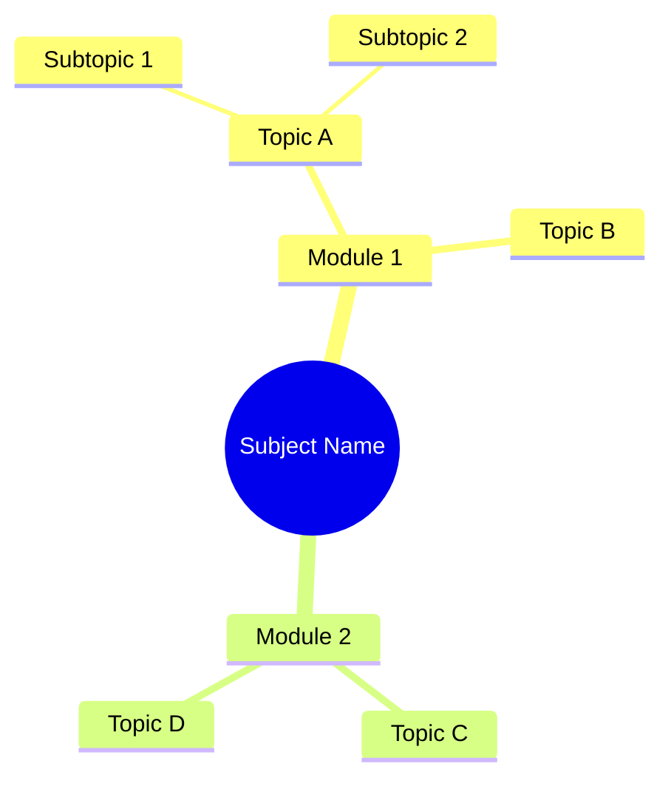

# Mindmap Generator Skill

Transform any syllabus, topic list, or free-form text into a hierarchical
**Mermaid.js mindmap** that can be rendered as Markdown, exported to SVG,
or fed into the project's animation pipeline.

## When to Use

Trigger this skill when the user asks to:
- Create a mindmap or concept map
- Visualize a topic hierarchy
- Generate a diagram from a syllabus
- Export structure for animation

## Instructions

### Step 1 – Sanitize Input
Call `sanitize_syllabus_text(raw_input)` for syllabus text, or
`sanitize_text(raw_input)` for free-form topic descriptions.

### Step 2 – Classify Query
Call `classify_query_semantics(clean_input)`. This skill applies to
`generative` and `conceptual` query types.

### Step 3 – ReAct Structure Loop
```
THOUGHT: What is the root concept? (subject name or main topic)
ACTION:  Extract root.
OBSERVE: Are there clear sub-topics / modules?
THOUGHT: Can we map: Root → Modules → Topics → Subtopics?
ACTION:  Build a 3-level hierarchy.
OBSERVE: Does every leaf node have at most 3–5 children? If more, cluster.
REFLECT: Is the Mermaid syntax valid? Check indentation and quoting.
```

### Step 4 – Mermaid Output Format


### Step 5 – Integration with Animation Pipeline
Pass the generated Mermaid script to the existing `MindMapGenerator2`:
```python
from visual.mindmap_v2 import MindMapGenerator2
gen = MindMapGenerator2()
gen.save_mindmap_markdown(mermaid_script, output_path)
```

### Output Format
````markdown
## 🗺️ Mindmap: {subject_name}


**Topics covered:** {N}
**Export options:** Markdown · SVG (render via mermaid.js) · Animation
````

## Security Rules
- Call `sanitize_syllabus_text()` on pasted syllabus content before extraction.
- Validate Mermaid output: no raw HTML, script tags, or injection in node labels.
- Sanitize each node label before embedding: `sanitize_text(label, max_length=80)`.

## Script Reference
- `scripts/syllabus_to_mindmap.py` – converts a syllabus text file to a `.mmd` Mermaid file.
